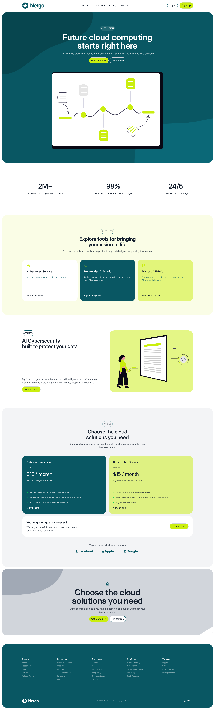

## 🎯 Project Overview

**Netgo** is a professional and modern cloud computing landing page built with **React**, styled using **Tailwind CSS**, and animated with **Framer Motion**. It's designed to showcase services for cloud infrastructure, SaaS platforms, and tech startups with high performance and responsiveness.

## 💡 Key Features

- ☁️ Hero section with engaging background and call-to-action
- 🧩 Modular product and solution cards with interactive animations
- 🌍 Modern grid-based layout with responsive design
- 💼 Company info, resources, and contact sections
- ✨ Scroll-based entrance animations for dynamic UX
- ⚡ Built with Vite for fast development and hot module reloading
- 🌐 Fully responsive using Tailwind CSS utilities

## 🛠️ Technologies Used

- **React 18** — UI Library
- **Vite** — Modern frontend tooling
- **React Router** — Client-side routing (if used)
- **Tailwind CSS** — Utility-first CSS framework
- **Framer Motion** — Animations and transitions
- **Render.com** — Deployment platform

## 🔗 Links

- Live Site: https://netgo-site.onrender.com/

## 📸 Screenshots

